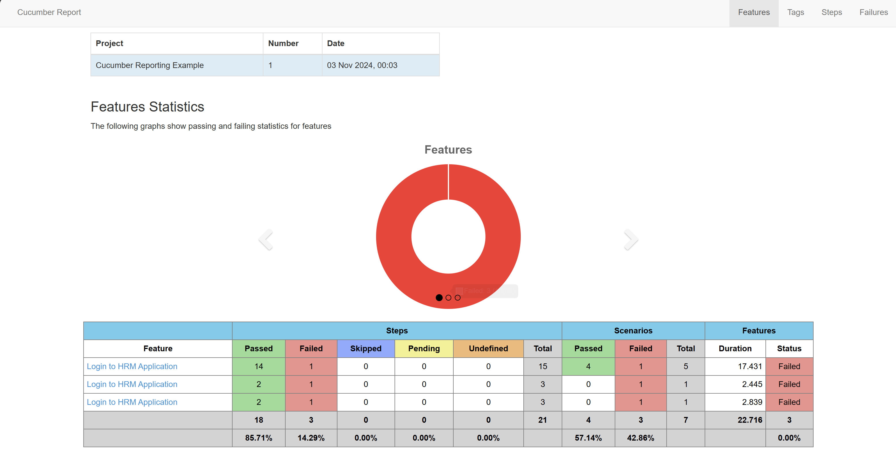

# Page Object Model with Cucumber, Selenium and TestNG

This is a sample application to demonstrate how to setup and run Cucumber tests with TestNG in Page Object Model.

1. This framework consists of:
````
   Cucumber – 7.18.1
   Java 17
   TestNG – 7.10.2
   Maven – 3.9.6
   Selenium – 4.25.0
   Maven Compiler - 3.13.0
   Maven Surefire - 3.3.1
````
   
2. To run the tests through command line, use the command
````
mvn clean test
````

3. TestNG Report - This framework contains sample TestNG Reports under **_test-output_** folder.

4. Cucumber Report - Add cucumber.properties under src/test/resources and use the below command:
````
cucumber.publish.enabled=true
````

5. MasterThought Plugin is used to create a detailed Cucumber Report in **_target/cucumber-html-reports_**


Dependency used to generate the report is
````
  <dependency>
      <groupId>net.masterthought</groupId>
      <artifactId>cucumber-reporting</artifactId>
      <version>${maven.cucumber.reporting.version}</version>
    </dependency>
````    

6. This setup shows how to rerun the failed tests in Cucumber using the plugin rerun
````
 plugin = {
            "rerun:target/rerun.txt" // Saves paths of failed scenarios
        }  
````
